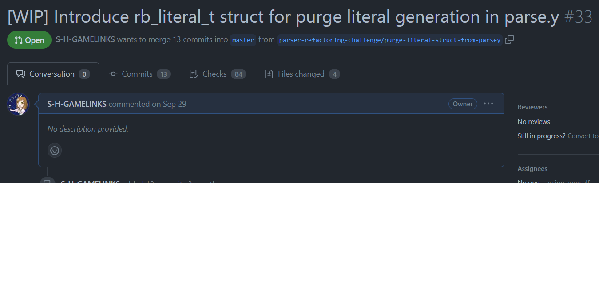

# Rubyのリテラルオブジェクト生成をparse.yから卒業させる

author
:   S.H.
theme
:   lightning-simple
content_source
:   Fukuoka.rb #333 Ninja Talk 大会

# 自己紹介

* S.H.
* 永和システムマネジメント
    アジャイル事業部所属 & 構文解析研究部員
* Hamada.rb
* 時々Rubyにパッチを投げてます

# 話すこと

* リテラルオブジェクトの生成をparse.y以外でしたい背景
* リテラルオブジェクトの生成をparse.y以外でさせる方法
* 今後の対応

# 背景(1)

* Numeric などのリテラルが parse.y で Ruby のオブジェクトとして生成されている
* Ruby のオブジェクトを作っているので GC から離せない
* parse.y を Universal Parser として扱うためには C API を自前で用意する必要がある

# 背景(2)

* リテラルの生成を別の場所へ移行できれば
    * GC との切り離しができる
    * Universal Parser の C API への依存を減らすことができる

# 背景(3)

* より詳しい話は [Ruby Parser開発日誌 (10) - parse.y リファクタリングチャレンジ はじめました](https://yui-knk.hatenablog.com/entry/2023/06/18/162100)

# 対応方法(ex: Numeric)

* `rubyparser.h`にリテラルの生成に必要な構造体を追加
* `compile.c`で、その構造体を使ってリテラルを生成する
* `parse.y`で構造体を使って値をセットする

# `rubyparser.h`に構造体を追加

```c
enum rb_literal_type {
    integer_literal,
    float_literal,
    rational_literal
};
```

# `rubyparser.h`に構造体を追加

```c
typedef struct rb_numeric_literal_info {
    int tminus;
    int base;
    int seen_point;
    int is_imaginary;
} rb_numeric_literal_info_t;
```

# `rubyparser.h`に構造体を追加

```c
typedef struct rb_literal_struct {
    char *val;
    enum rb_literal_type type;
    rb_numeric_literal_info_t numeric_literal_info;
} rb_literal_t;
```

# `rubyparser.h`に構造体を追加

```c
typedef struct RNode_LIT {
    NODE node;
    VALUE nd_lit;
    VALUE not_used;
    VALUE not_used2;
    rb_literal_t *literal;
} rb_node_lit_t;
```

# `compile.c`でリテラルを生成

```c
VALUE
rb_compile_numeric_literal(rb_literal_t *literal)
{
    if (literal->type == integer_literal) {
        return rb_compile_integer_literal(literal);
    } else if (literal->type == float_literal) {
        return rb_compile_float_literal(literal);
    } else if (literal->type == rational_literal) {
        return rb_compile_rational_literal(literal);
    }
    return 0;
}
```

# `compile.c`でリテラルを生成

```c
static VALUE
rb_compile_integer_literal(rb_literal_t *literal)
{
    VALUE lit = rb_cstr_to_inum(literal->val, literal->numeric_literal_info.base, FALSE);
    return compile_numeric_literal(literal, lit);
}
```

# `compile.c`でリテラルを生成

```c
static VALUE
compile_numeric_literal(rb_literal_t *literal, VALUE val)
{
    if (literal->numeric_literal_info.tminus) {
        val = compile_negative_numeric(val);
    }
    if (literal->numeric_literal_info.is_imaginary) {
        val = rb_complex_raw(INT2FIX(0), val);
    }
    return val;
}
```


# `parse.y`で構造体に値をセット

```c
static enum yytokentype
set_number_literal(struct parser_params *p, enum yytokentype type, int suffix, int base, int seen_point)
{
    /* ... */
    rb_literal_t *literal = malloc(sizeof(rb_literal_t));
    literal->val = strdup(tok(p));
    literal->numeric_literal_info.tminus = FALSE;
    literal->numeric_literal_info.base = base;
    literal->numeric_literal_info.seen_point = seen_point;
    literal->numeric_literal_info.is_imaginary = FALSE;
    literal->numeric_literal_info.is_tokenline = FALSE;
    /* ... */
}
```

# できたもの

* [[WIP] Introduce rb_literal_t struct for purge literal generation in parse.y](https://github.com/S-H-GAMELINKS/ruby/pull/33)



# 対応状況

* Numeric(Fixnum, Bignum, Float, Rational, Complex) は対応完了
* Symbol は一部対応
* そのほか細々としたものにも対応中

# 今後の対応

* Ractor 周りでのリテラルオブジェクトの処理
* NODE_STR などから NODE_LIT へ変換している箇所の対応がまだ
* とりあえず動くレベルなのでコードの整理をしたい

